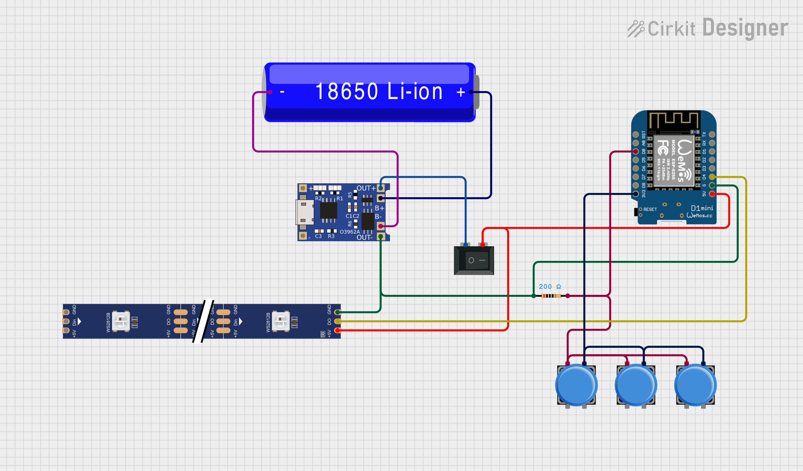
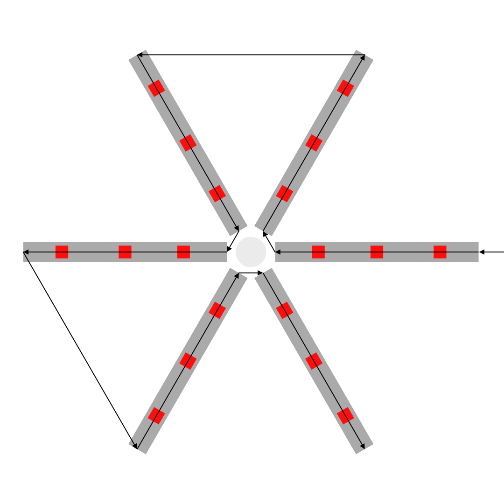

# Electronics

## Required components
- ESP8266 - I used a Wemos D1 mini
- Battery charging module - I used [TP4056](https://www.laskakit.cz/nabijecka-li-ion-clanku-tp4056-s-ochranou-microusb/)
- Battery - I used [18650 with pre-soldered leads](https://www.gme.cz/v/1506728/westinghouse-18650-1s1p-li-ion-2600mah-akumulator)
- Neopixels light strip - 6 times 3 LEDs of the 60/m type (I think.)
- MX keayboard switches - 3 of any time you found pleasing, stronger switches are better (the lid is heavy)
- Switch - Just a simple on/off switch - [This](https://www.laskakit.cz/prepinac-kolebkovy-3a-250vac/) works in the 3D model
- Resistor - Pulldown for the switches. TBH I have no idea what value I used.

## Wiring
Main components:

LED strip signal directions:
